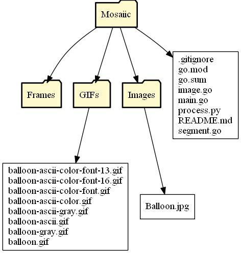

# Mosaiic

Create cool animated Image mosaics!

## Usage

```
go run *.go [optional arguments] filename output
```

```
  -ascii
        Use ASCII Graphics.
  -bold
        Use Bold Characters.
  -color
        Include color with ASCII.
  -font float
        Font size for ASCII Graphics. (default 6)
  -fontstop float
        Stopping font size. (default -1)
  -fps float
        GIF Frames per second. (default 1)
  -grayscale
        Grayscale the image.
  -io
        Add Zoom In/Out animation to GIF
  -keep
        Keep frames used for GIF.
  -square
        Use square bounding box for characters.
```

Created GIFs are stored in the `GIFs` directory. The frames used to create GIFs are stored in the `Frames` directory temporarily. If you'd like to keep them, make sure to specify `-keep` when you run the script. Directory tree made using the [Directory Grapher Tool](https://github.com/AlexEidt/Directory-Grapher).



<br />

## Dependencies

* Python 3.7+
* Go 1.16

### Libraries

```
pip install imageio
pip install imageio-ffmpeg --user

go get -u github.com/fogleman/gg
```

Python is used via a system call to create the GIFs. The Golang GIF library took very long to process each frame which is why this approach was used. Feel free to use any GIF creation method you'd like though. See `main.go` lines `59-64` to deactivate this system call.

# Gallery

## Original Image


## ASCII (Monochrome)

```
go run *.go -ascii Images/Balloon.jpg balloon-ascii
```


<br />

## ASCII Grayscaled

```
go run *.go -grayscale -ascii Images/Balloon.jpg balloon-ascii-gray
```


<br />

## ASCII Color

```
go run *.go -color -ascii Images/Balloon.jpg balloon-ascii-color
```


<br />

## ASCII Font Size 10

```
go run *.go -ascii -font 10 Images/Balloon.jpg balloon-ascii-color-font
```


<br />

## ASCII Font Size 13

```
go run *.go -ascii -font 13 Images/Balloon.jpg balloon-ascii-color-font-13
```


<br />

## ASCII Font Size 16

```
go run *.go -ascii -font 16 Images/Balloon.jpg balloon-ascii-color-font-16
```


<br />

## Color

```
go run *.go Images/Balloon.jpg balloon
```


<br />

## Grayscaled

```
go run *.go -grayscale Images/Balloon.jpg balloon-gray
```


<br />

## Zoom In/Out

```
go run *.go -io Images/Balloon.jpg balloon-io
```


<br />